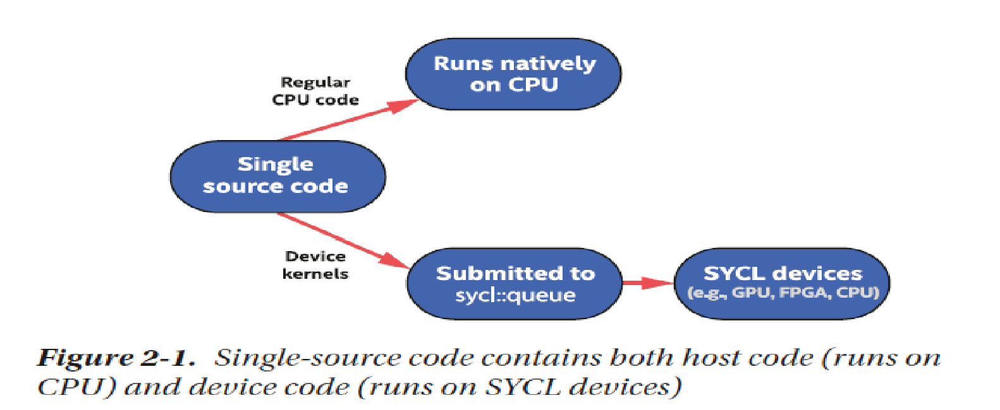
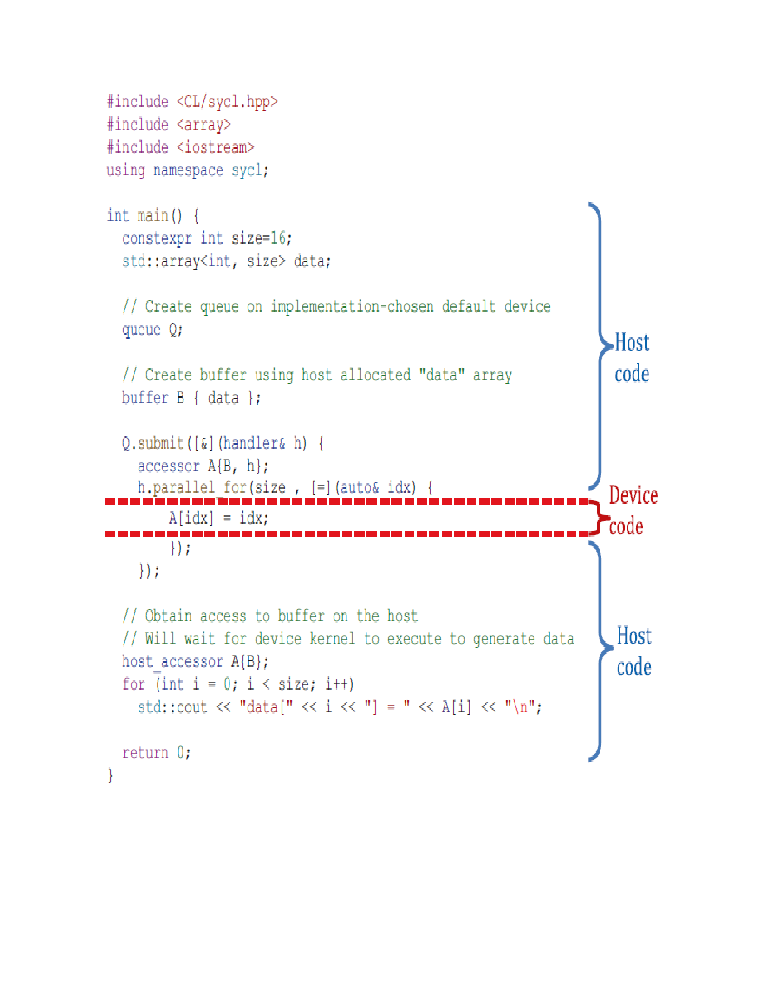

# High Performance Image Processing With SYCL
# Table of content
- [Introduction](#Introduction)
- [What is SYCL ?](#What-is-SYCL-?)
- [Getting started](#Getting-started)
- - [Prerequisite](##Prerequisite)
- - - [RGB converts to Binary image](###RGB-converts-to-Binary-image)
- - - [C++ library for image processing](###C++-library-for-image-processing)
- - [Implement image processing via SYCL](##Implement-image-processing-via-SYCL)
- - - [HelloWorld](###HelloWorld)
- - - [Data management](###Data-management)
- - - - [Unified Shared Memory(USM)](####Unified-Shared-Memory(USM))
- - - - [Buffer](####Buffer)
- - - [Performance between buffer and USM](###Performance-between-buffer-and-USM)
- - - [Parallelism](###Parallelism)
- [Conclusion](#Conclusion)
- [References](#References)
# Introduction
Image processing is a process to perform some operations on an image to improve the image or extract some information about it. The application of image processing is in machine learning, robot vision, and so on. As a digital image is stored in the form of an RGB matrix, many image processing algorithms are simply manipulating each pixel value. Thus, they will run faster if they run parallelly.   
# What is SYCL ?
SYCL (pronounce as "sickle") is a framework API defined by Khronos for C++ targeting heterogeneous computing. This means that SYCL allows the developer to run C++ code on many devices such as CPU, GPU, FPGA, and so on. Programmers can take advantage of this to deploy algorithms that run faster when they are computed in parallel on these devices to reduce time complexity and accelerate performance. 

Currently, 3 main companies are developing a compiler for SYCL: Intel, Codeplay, and AMD. For this report, I use **Intel compiler** because it is the most mature one among them.
# Getting started
To begin, all of the sample codes are run on [Intel development cloud for OneAPI](https://devcloud.intel.com/oneapi/get_started/). The hardware devices chosen to run code are Intel CPU and Intel GPU. The reader who would like to start can create an account on Intel development cloud for one API. In addition, reader must have knowledge about [lambda function in c++](https://learn.microsoft.com/en-us/cpp/cpp/lambda-expressions-in-cpp?view=msvc-170)
## Prerequisite
This section is to provide basic knowledge for reader about image processing in C++.
### RGB converts to Binary image
This algorithm is simple to create. Digital images usually have 3 different channels: Red, Green and Blue. They are arranged in the form of 2-D matrix. The value stored in each matrix represent the intensity of color. Mostly RGB digital images store pixel value within the range from 0 to 255. The image bellow explains this clearly.

To convert RGB to binary image, we need to have a threshold to compare with the average sum of 3 pixels value of Red, Green and Blue. If the result is larger than threshold value, it will become 255. If not, the pixel value will turn into 0. Here is the pseudo c++ code for this algorithm
```cpp=
 int threshold=123;
  for(int i=0 ;i <height*width ;i++){
    r[i] = ((r[i] + g[i] + b[i])/3 > threshold)? 0 :255;
    g[i] = r[i];
    b[i] = r[i];
  } 
```
### C++ library for image processing
The C++ library used in this report is [Cimg libary](https://cimg.eu/). It is a single header file, and it is easy to use. Cimg not only provides API to load and save the image but also displays the image. It is necessary to disable this display feature of Cimg as it causes an error for the Intel compiler in the Intel development cloud because it cannot find necessary header files and library files. Hence, in the header file **Cimg.h**, add this line to disable the display feature of the Cimg library.
```cpp=
#define cimg_display 0
```
It is important to note that the file image type in here is the bitmap type because bitmap is the only image file type that Cimg can load without additional support from other libraries.


## Implement image processing via SYCL
### HelloWorld
In SYCL, there are 2 types of codes: code for the host and code for the device(or kernel code). The host code is the code run on the CPU, and the kernel code is the code run on other devices such as GPU, FPGA, TPU, and so on. This image from "Data Parallel C++" book illustrates very well.

To control the data movement between the host and device, SYCL creates an special abstract object named queue. Inside the queue, we need to create an event which consists of a function to process data on devices. Therefore, many [**lambda functions**](https://learn.microsoft.com/en-us/cpp/cpp/lambda-expressions-in-cpp?view=msvc-170) are commonly used. Here is an example code from "Data Parallel C++" book to show which code region belong to host and device

We can choose a device to pass into the queue so that it knows what device is used to accelerate computation. There are main 3 devices: CPU, GPU, and accelerators(FPGA, DSP, TPU, and so on).
```cpp=
sycl::cpu_selector device; //Choose cpu 
sycl::gpu_selector device; //Choose gpu
sycl::accelerator_selector device; //Choose accelerator which can be FPGA, DSP, TPU and so on
```

To get information on what device will be used, SYCL provides the "get_info" method. Below is the simple code to get information of choosing a device for computation
```cpp=
void say_device(const sycl::queue&q){
    std::cout << "Running on " << q.get_device().get_info<sycl::info::device::name>()
       << "\n";
}
```

To print the "hello world" in kernel code, SCYL provides its own stream to do that. The example code is provided below
```cpp=
#include <iostream>
#include <CL/sycl.hpp> //This header file must be included
class my_kernel;
void say_device(const sycl::queue&q){
    std::cout << "Running on " << q.get_device().get_info<sycl::info::device::name>()
       << "\n";
}
int main(){
    sycl::cpu_selector device;
    sycl::queue Q(device);
    say_device(Q);
    Q.submit([&](sycl::handler &cgh){
      auto os =sycl::stream(1024,1024,cgh);
      cgh.single_task<my_kernel>([=]()
      {
         os <<"Hello World!\n";
      });
   }).wait();
    return 0;
}
```
Now log in to the Intel development cloud via SSH, I log in to the node containing both Intel CPU and GPU. Run the following command to compile and run the code.
```cmd=
icpx -fsycl hello_cpu.cpp -o hello.cpu
./hello.cpu
```
It is important to note that coder must pass **-fsycl** flag to Intel compiler to compile SYCL code. 
The result is 
```cmd=
Running on 11th Gen Intel(R) Core(TM) i9-11900KB @ 3.30GHz
Hello World!
```
If we replace CPU by GPU, we get this result
```cmd=
Running on Intel(R) UHD Graphics [0x9a60]
Hello World!
```
The queue.submit() method is to submit the code running on the device. The "sycl::handler" gives the user access and creates a command inside the device scope. In the above program, we use a handler to create a single task running asynchronously, and we use wait() method to wait for the program to complete. The single_task method needs a kernel to pass a function. Here we pass the class my_kernel to a single task and create a lambda function to print "Hello World".  
### Data management
There are 2 types of Data management in SYCL, the C style which uses Unified Shared Memory, and the C++ style which SYCL provides its buffer.
#### Unified Shared Memory(USM)
USM is the pointer-based approach to managing memory. Let's create 3 arrays which are 1 dimension and contains 5 unsigned char. 
```cpp=
sycl::queue q{sycl::cpu_selector{}};
auto a=sycl::malloc_device<unsigned char,1>(5,q);
auto b=sycl::malloc_host<unsigned char,1>(5,q);
auto c=sycl::malloc_shared<unsigned char,1>(5,q);
```
We allocate 3 types of memory: one for a device, one for the host, and one for sharing both the host and device. This table summarizes the characteristics of each allocation type:


|  Allocation type |Description   |Accessible on host?   |Accessible on device?   | Located on  |
|---|---|---|---|---|
|  device |Allocations in device memory   |no   |yes   |device   |
|   host|Allocations in host memory   |yes   |no   |host   |
|shared   |Allocatations shared between host and device memory   | yes  |yes   |can migrate back and forth   |

SYCL provides the method memcpy() which is similar to std::memcpy() to transfer data either from host to device or vice-versa.
```cpp=
sycl::queue q;
int a[5] ={1,2,3,4,5};
auto b=sycl::malloc_device<int,1>(5,q);
q.memcpy(b,&a[0],5*sizeof(int));
```
To deallocate memory, another method "sycl::free()" is needed to be called
```cpp=
sycl::queue q;
auto b=sycl::malloc_device<int,1>(5,q);
sycl::free(b,q);
```
Now, let's apply it to convert the RGB image to a binary image, here is the code 
```cpp=
#include <CL/sycl.hpp>
#include <chrono>
#include <iostream>
#include "CImg.h"
using namespace cimg_library;
class my_kernel;
void say_device(const sycl::queue&q){
    std::cout << "Running on " << q.get_device().get_info<sycl::info::device::name>()
       << "\n";
}
int main(){
    sycl::cpu_selector device;
    sycl::queue Q(device);
    say_device(Q);
    CImg<unsigned char> image("Lenna.bmp");
    int w = image.width();
    int h = image.height();
    //Get pixel array from image
    unsigned char*ptr = image.data();
    //Get Red pixel array from image
    unsigned char *host_R = &ptr[0]; 
    //Get Green pixel array from image
    unsigned char *host_G = &ptr[0+h*w];
    //Get Blue pixel array from image
    unsigned char *host_B = &ptr[0+2*h*w];
    //Allocate device memory
    auto dev_R = sycl::malloc_device<unsigned char>(h*w,Q);
    auto dev_G = sycl::malloc_device<unsigned char>(h*w,Q);
    auto dev_B = sycl::malloc_device<unsigned char>(h*w,Q);
    
    auto start = std::chrono::steady_clock::now();
    //Copy data from host to device
    Q.memcpy(dev_R,host_R,h*w*sizeof(unsigned char));
      Q.memcpy(dev_G,host_G,h*w*sizeof(unsigned char));
      Q.memcpy(dev_B,host_B,h*w*sizeof(unsigned char));
    Q.submit([&](sycl::handler &cgh){
     
      cgh.single_task<my_kernel>([=]()
      {
         for(int i=0;i<h*w;i++){
            dev_R[i] = ((dev_R[i]+dev_G[i]+dev_B[i])/3>123)?255:0;
            dev_G[i] = dev_R[i];
            dev_B[i] = dev_R[i];
         }
      });
     
   }).wait();
    Q.memcpy(host_R,dev_R,h*w*sizeof(unsigned char));
      Q.memcpy(host_G,dev_G,h*w*sizeof(unsigned char));
      Q.memcpy(host_B,dev_B,h*w*sizeof(unsigned char));
      Q.wait();
   auto end = std::chrono::steady_clock::now();
   std::cout<<"Kernel submission + execution time: "
   <<std::chrono::duration_cast<std::chrono::microseconds>(end - start).count()
   <<" microsec\n";
   //Deallocate device memory
   sycl::free(dev_R,Q);
   sycl::free(dev_G,Q);
   sycl::free(dev_B,Q);
   image.save("binary.bmp");
   return 0;
}
```
It is noted that we use wait() method 2 times: one for waiting for the conversion and one for waiting for all data to transfer from the device to host memory. It is necessary to do because every method in the queue runs asynchronously. The host program may end before the all data is transferred, which may lead to our image being partially converted to a binary image.
Compile and the program by using these commands:
```cmd==
 icpx -fsycl bin_single_usm.cpp -o bin_usm_img.cpu
 ./bin_usm_img.cpu

```
We got the result and binary image
```cmd==
Running on 11th Gen Intel(R) Core(TM) i9-11900KB @ 3.30GHz
Kernel submission + execution time: 26081 microsec
```
Original image

Binary image

#### Buffer
Buffer is the abstract data object provided by SYCL. Element in the buffer can be primitive type(int, char, float) or user-defined type class, struct. 
Here is an example of the declaration of buffer in SCYL
```cpp=
constexpr int size = 5;
int a[5] = {1,2,3,4,5};
auto b = sycl::buffer<int,1>{a,sycl::range{size}};
```
In the above example, we create 1 dimension buffer for integer type and contain 5 elements getting from array a. Note that to declare the size of the buffer, we have to use "sycl::range" and provide it with **constexpr** size because "sycl::range" only accept constant variable initializing at compile time.
For the device to access data inside the buffer in the queue, we need to declare an accessor, below is the typical example
```cpp=
constexpr int size = 5;
int a[5] = {1,2,3,4,5};
auto b = sycl::buffer<int,1>{a,sycl::range{size}};
sycl::queue q{sycl::cpu_selector{}};
{
    Q.submit([&](sycl::handler &cgh){
            //Access to buffer from device side in read_write mode
            sycl::accessor R{b, cgh, sycl::read_write};
});
}
```
We create an accessor R for the device to access data from the buffer. It is noted that we declare queue submit inside the scope which will automatically transfer data back from the device to the host after the job is done. 

Now we rewrite the convert RGB to a binary image using buffer style
```cpp=
#include <CL/sycl.hpp>
#include <chrono>
#include <iostream>
#include "CImg.h"
using namespace cimg_library;
class my_kernel;
void say_device(const sycl::queue&q){
    std::cout << "Running on " << q.get_device().get_info<sycl::info::device::name>()
       << "\n";
}
constexpr int sz = 512*512;
int main(){
    
    CImg<unsigned char> image("Lenna.bmp");
    int w = image.width();
    int h = image.height();
    std::cout<<"w: "<<w<<" h: "<<h<<"\n";
    //Get pixel matrix from image
    unsigned char*ptr = image.data();
    //Get Red pixel matrix from image
    unsigned char *host_R = &ptr[0]; 
    //Get Green pixel matrix from image
    unsigned char *host_G = &ptr[0+h*w];
    //Get Blue pixel matrix from image
    unsigned char *host_B = &ptr[0+2*h*w];
    auto start = std::chrono::steady_clock::now();
   
    {
    sycl::cpu_selector device;
    sycl::queue Q(device);
    say_device(Q);
    //Create a buffer
    auto bufR = sycl::buffer<unsigned char,1>{host_R,sycl::range{ sz}};
    auto bufG = sycl::buffer<unsigned char,1>{host_G,sycl::range{sz}};
    auto bufB = sycl::buffer<unsigned char,1>{host_B,sycl::range{sz}};
    Q.submit([&](sycl::handler &cgh){
            //Access to buffer from device side in read_write mode
            sycl::accessor R{bufR, cgh, sycl::read_write};
            sycl::accessor G{bufG, cgh, sycl::read_write};
            sycl::accessor B{bufB, cgh, sycl::read_write};
            cgh.single_task<my_kernel>([=]()
      {
                for(int i=0;i<sz;i++){
                    R[i] = ((R[i]+G[i]+B[i])/3>123)?255:0;
                    G[i] = R[i];
                    B[i] = R[i];
                }
      });
     
   }).wait();
    }
    //After go out of scope, data from buffer will be copied back to data in host
   auto end = std::chrono::steady_clock::now();
   std::cout<<"Kernel submission + execution time: "
   <<std::chrono::duration_cast<std::chrono::microseconds>(end - start).count()
   <<" microsec\n";
   image.save("binary.bmp");
    return 0;
}
```
### Performance between buffer and USM
Here is the table to compare the performance between buffer and USM of RGB to binary image algorithm
USM style
|Device			|Runtime 1 (microsecond)   |Runtime 2(microsecond)  |Runtime 3 (microsecond)   |Runtime 4 (microsecond)  |
|---|---|---|---|---|
|  CPU Intel core i9-11900KB|24576   | 24468  | 24507  |  24290  |
| GPU Intel UHD Graphic			  | 1282213  | 1294717	  | 1269041  |  1265609 |

Buffer style
|Device			|Runtime 1 (microsecond)   |Runtime 2(microsecond)  |Runtime 3 (microsecond)   |Runtime 4 (microsecond)  |
|---|---|---|---|---|
|  CPU Intel core i9-11900KB|382013			   |415531  | 377118 |  387725  |
| GPU Intel UHD Graphic			  | 17446881  | 1294717	  | 1269041  |  1265609 |

It is clear to see that the performance using the USM style is better than using the Buffer style.
### Parallelism
All of the previous examples use single_task in kernel code. Because single_task only runs once inside the kernel code, it acts like sequential code. To achieve parallel, SYCL provides parallel_for() method to run parallelly. Here is an example code 
```cpp=
sycl::queue Q{sycl::cpu_selector{}};
int size = 10;
auto data = sycl::malloc_device<int,1>(size,Q);
 Q.submit([&](sycl::handler &cgh){
     
     cgh.parallel_for(size,[=](sycl::id<1>i){
        data[i] = -1;
     });
     
   }).wait();
```
The "sycl::id" represents the current index which is from 0 to size.
Thus, we can replace single_task in the code rgb to a binary image by parallel_for in the USM style
```cpp==
cgh.parallel_for(sz,[=](sycl::id<1>i){
        dev_R[i] =((dev_R[i]+dev_G[i]+dev_B[i])/3>123)?255:0; ;
        dev_G[i] = dev_R[i];
        dev_B[i] = dev_R[i];
     });
```

These tables below show the time compute in parallel in both USM style and Buffer style
USM style
|Device			|Runtime 1 (microsecond)   |Runtime 2(microsecond)  |Runtime 3 (microsecond)   |Runtime 4 (microsecond)  |
|---|---|---|---|---|
|  CPU Intel core i9-11900KB|24328   | 23828  | 23785  |  23882  |
| GPU Intel UHD Graphic			  |49086			  | 45907  |45844  |  45584|

Buffer style
|Device			|Runtime 1 (microsecond)   |Runtime 2(microsecond)  |Runtime 3 (microsecond)   |Runtime 4 (microsecond)  |
|---|---|---|---|---|
|  CPU Intel core i9-11900KB|159990					   |158718  | 165207 | 160860  |
| GPU Intel UHD Graphic			  | 129209 | 100732	  | 128190  |  127287 |

Compared to the time complexity table of using single_task, the using of parallel_for reduces time complexity significantly.


# Conclusion
SYCL provides an efficient way to create high performance image processing in C++ .The clear advantage of SYCL is that it can run on any devices such as CPU, GPU, FPGA and other accelerators.
# Reference
[Data Parallel C++ Book](https://link.springer.com/book/10.1007/978-1-4842-5574-2)
[Intel OneAPI example](https://devcloud.intel.com/oneapi/get_started/baseToolkitSamples/)
[SYCL 2020 specification by the Khronos Group](https://registry.khronos.org/SYCL/specs/sycl-2020/html/sycl-2020.html#introduction)
[SYCL workshop from ENCCS](https://enccs.github.io/sycl-workshop/what-is-sycl/)
[Implement Sobel filter in SYCL](https://www.codeproject.com/Articles/5284847/5-Minutes-to-Your-First-oneAPI-App-on-DevCloud)


